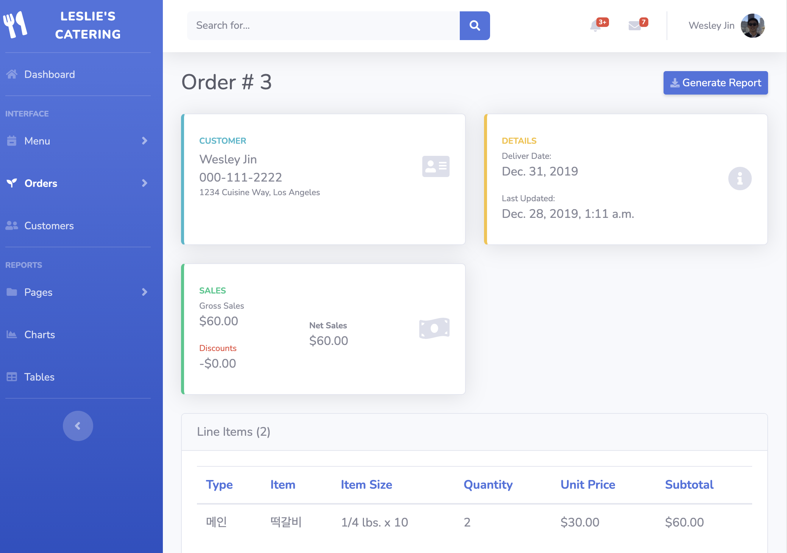
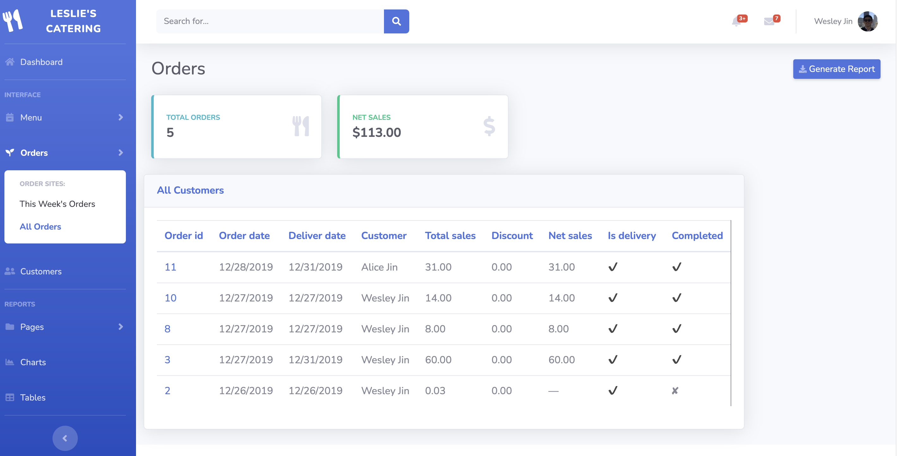

# Jin Catering App
> Personal project dedicated to & for use by my hardworking mom! Not intended for production use. Only used locally on a single machine.

Order management tool for Leslie's Korean Catering.




## Dependencies
* Python 3.8
    * Django 3.1.7
    * Other dependencies in `requirements.txt` or `Pipfile.lock`

* Bootstrap v4.3
    * [SB Admin 2 Template](https://startbootstrap.com/theme/sb-admin-2)


## Running Locally
* Check that DB is running locally, and available on port 5439
* Start the server:
    ```bash
    $ python manage.py runserver
    ```
